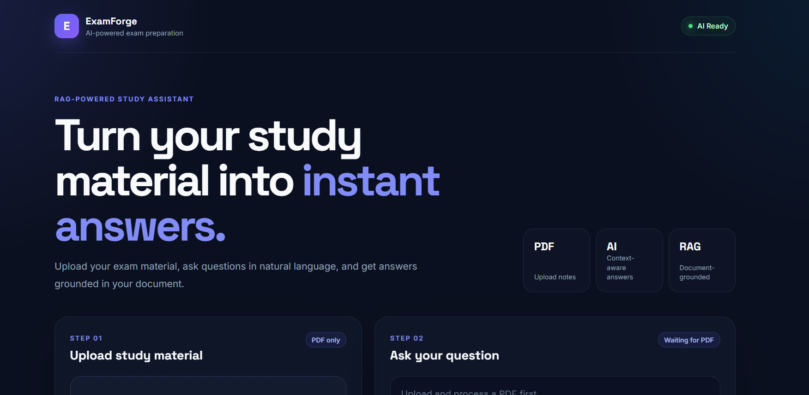
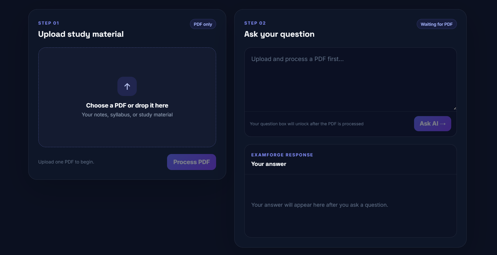
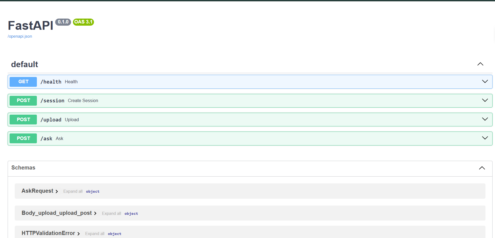

# ExamForge

> An AI-powered Retrieval-Augmented Generation (RAG) study assistant that transforms static PDF study material into an interactive question-answering experience.

ExamForge allows users to upload study material, process it into a searchable knowledge base, and ask questions in natural language. Instead of answering purely from general model knowledge, the application retrieves relevant information from the uploaded document and generates responses grounded in that context.

---

## 🚀 Live Demo

ExamForge is fully deployed with the React frontend hosted on Vercel and the FastAPI backend deployed separately.

| Service | Platform | Link |
|---|---|---|
| Frontend | Vercel | [Launch ExamForge](https://exam-forge-ai.vercel.app) |
| Backend API | Code.Run | [Open API Health Check](https://p01--examforge-ai-cqw7qvc7vd22.code.run/health) |
| API Documentation | FastAPI Swagger | [View Interactive API Docs](https://p01--examforge-ai-cqw7qvc7vd22.code.run/docs) |

---

## ✨ Key Features

- 📄 Upload and process PDF study material
- 🧠 Retrieval-Augmented Generation (RAG) pipeline
- 🔍 Semantic search using vector embeddings
- 💬 Ask questions in natural language
- 📚 Answers grounded in the uploaded document
- 🚫 Handles questions whose answers are not present in the material
- 🔗 Source references included with generated responses
- ⚡ FastAPI backend with RESTful API endpoints
- 🎨 Modern React frontend
- 🗂️ Session-based document workflow
- 🧬 ChromaDB vector database integration
- 🤖 Groq-powered LLM inference
- 🐳 Docker support for backend containerization
- 📱 Responsive and polished user interface

---

# 📌 Overview

Traditional study material is static. Finding a specific concept inside a long PDF can be time-consuming, especially when users need quick answers from their own notes or syllabus.

**ExamForge solves this by turning uploaded study material into an interactive knowledge source.**

The application processes the document, converts its contents into vector embeddings, stores them in a vector database, and retrieves the most relevant information whenever the user asks a question.

The overall workflow is:

```text
Upload PDF
    ↓
Extract Document Content
    ↓
Split Content into Chunks
    ↓
Generate Vector Embeddings
    ↓
Store in ChromaDB
    ↓
User Asks a Question
    ↓
Retrieve Relevant Context
    ↓
LLM Generates Grounded Answer
    ↓
Return Answer with Source References
```

---

# 🏗️ Architecture

ExamForge follows a decoupled frontend-backend architecture.

```text
                         ┌──────────────────────┐
                         │    React Frontend    │
                         │                      │
                         │  • Upload PDF        │
                         │  • Ask Questions     │
                         │  • Display Answers   │
                         └──────────┬───────────┘
                                    │
                              REST API / HTTP
                                    │
                                    ▼
                         ┌──────────────────────┐
                         │   FastAPI Backend    │
                         │                      │
                         │  • Session Handling  │
                         │  • PDF Processing    │
                         │  • RAG Pipeline      │
                         └──────────┬───────────┘
                                    │
                    ┌───────────────┼────────────────┐
                    │               │                │
                    ▼               ▼                ▼
             ┌────────────┐  ┌────────────┐  ┌────────────┐
             │ PDF Parser │  │  ChromaDB  │  │  Groq LLM  │
             │ & Chunking │  │Vector Store│  │ Inference  │
             └────────────┘  └────────────┘  └────────────┘
```

---

# 🧠 How the RAG Pipeline Works

The core functionality of ExamForge is based on **Retrieval-Augmented Generation**.

## 1. Document Upload

The user uploads a PDF from the React frontend.

```text
User
  ↓
React Frontend
  ↓
FastAPI Backend
```

A session is used to associate the uploaded material with the user's subsequent questions.

---

## 2. Document Processing

The backend extracts the textual content from the uploaded PDF.

```text
PDF
 ↓
Text Extraction
 ↓
Raw Document Content
```

The extracted content is prepared for further processing.

---

## 3. Text Chunking

A complete document is often too large to send directly to an LLM.

The document is therefore divided into smaller chunks.

```text
Document
   ↓
┌─────────┐
│ Chunk 1 │
├─────────┤
│ Chunk 2 │
├─────────┤
│ Chunk 3 │
├─────────┤
│   ...   │
└─────────┘
```

This allows the application to retrieve only the most relevant parts of the document for a specific question.

---

## 4. Embedding Generation

Each text chunk is converted into a vector representation.

Embeddings capture the semantic meaning of the text, allowing the system to perform similarity-based retrieval instead of relying only on exact keyword matches.

For example, a user can ask:

> What topics are covered in the syllabus?

Even if the exact words "topics are covered" do not appear in the document, the embedding-based retrieval system can still locate semantically relevant content.

---

## 5. Vector Storage

The generated embeddings are stored in **ChromaDB**.

```text
Document Chunks
       ↓
Generate Embeddings
       ↓
ChromaDB Vector Store
```

The vector database acts as the searchable knowledge base for the uploaded document.

---

## 6. Question Processing

When the user asks a question, the application retrieves the most relevant document chunks.

```text
User Question
      ↓
Question Embedding
      ↓
Semantic Similarity Search
      ↓
Relevant Document Chunks
```

---

## 7. Context-Grounded Answer Generation

The retrieved document context is combined with the user's question and sent to the LLM.

```text
User Question
        +
Retrieved Context
        ↓
     Groq LLM
        ↓
Grounded Answer
        ↓
Source References
```

The goal is to ensure that responses are generated from information retrieved from the uploaded material.

If the application cannot find relevant information in the document, it returns an appropriate response instead of presenting unrelated information as if it came from the user's material.

---

# 🎨 Application Workflow

```text
┌───────────────────────────┐
│      Upload Material      │
│                           │
│        Select PDF         │
└─────────────┬─────────────┘
              │
              ▼
┌───────────────────────────┐
│    Process Document       │
│                           │
│  Extract + Chunk + Embed  │
└─────────────┬─────────────┘
              │
              ▼
┌───────────────────────────┐
│      Document Ready       │
│                           │
│ Knowledge Base Available  │
└─────────────┬─────────────┘
              │
              ▼
┌───────────────────────────┐
│     Ask a Question        │
│                           │
│    Natural Language       │
└─────────────┬─────────────┘
              │
              ▼
┌───────────────────────────┐
│    Retrieve Context       │
│                           │
│  Vector Similarity Search │
└─────────────┬─────────────┘
              │
              ▼
┌───────────────────────────┐
│      AI Response          │
│                           │
│ Grounded in Document      │
│ + Source References       │
└───────────────────────────┘
```
---

# 📸 Application Screenshots

## 🏠 ExamForge Home



The landing interface provides a clear overview of the RAG-powered study assistant and guides users through the PDF upload and question-answering workflow.

---

## 📄 PDF Upload and Document-Grounded Answers



Users can upload PDF study material, process it into a searchable knowledge base, and ask questions in natural language. Generated responses are grounded in the uploaded document and include source references.

---

## 🔌 Interactive API Documentation



The FastAPI backend exposes interactive Swagger documentation, allowing API endpoints to be explored and tested directly.
---

# 🛠️ Tech Stack

## Frontend

| Technology | Purpose |
|---|---|
| React | User interface development |
| Vite | Frontend build tooling |
| JavaScript | Application logic |
| CSS | Custom styling and responsive design |
| Axios | Frontend-backend API communication |

## Backend

| Technology | Purpose |
|---|---|
| Python | Core backend language |
| FastAPI | REST API development |
| Uvicorn | ASGI application server |
| LangChain | RAG workflow orchestration |
| ChromaDB | Vector database |
| Groq | LLM inference |
| Docker | Backend containerization |

---

# 📊 Project Highlights

| Category | Implementation |
|---|---|
| Application Type | Full-stack AI/RAG application |
| Input Format | PDF documents |
| Frontend | React + Vite |
| Backend | FastAPI |
| RAG Framework | LangChain |
| Vector Database | ChromaDB |
| LLM Inference | Groq |
| Retrieval Method | Semantic similarity search |
| Embedding-Based Search | Yes |
| Session-Based Workflow | Yes |
| Source References | Yes |
| Docker Support | Yes |
| Frontend/Backend Separation | Yes |
| Deployment | Vercel + Code.Run |

---

# 📂 Project Structure

```text
examforge/
│
├── app/
│   └── Backend application modules
│
├── chroma_db/
│   └── ChromaDB vector storage
│
├── examforge-frontend/
│   │
│   ├── src/
│   │   ├── components/
│   │   │   ├── Header.jsx
│   │   │   └── UploadSection.jsx
│   │   │
│   │   ├── services/
│   │   │   └── api.js
│   │   │
│   │   ├── App.jsx
│   │   ├── App.css
│   │   ├── index.css
│   │   └── main.jsx
│   │
│   ├── package.json
│   └── vite.config.js
│
├── Dockerfile
├── docker-compose.yml
├── main.py
├── requirements.txt
├── .env.example
├── .gitignore
└── README.md
```

---

# 🔌 API Workflow

ExamForge follows a session-based workflow to manage document interactions.

## Step 1 — Create Session

Before processing a document, the frontend initializes a session.

```text
Frontend
   ↓
Create Session Request
   ↓
FastAPI Backend
   ↓
Session Created
```

The session is then used to associate the uploaded document and subsequent questions.

---

## Step 2 — Upload and Process Document

```text
Frontend
   ↓
Upload PDF
   ↓
FastAPI
   ↓
Extract Text
   ↓
Split into Chunks
   ↓
Generate Embeddings
   ↓
Store in ChromaDB
   ↓
Document Ready
```

---

## Step 3 — Ask a Question

```text
Frontend
   ↓
Submit Question
   ↓
FastAPI
   ↓
Retrieve Relevant Chunks
   ↓
Provide Context to LLM
   ↓
Generate Answer
   ↓
Return Response + Sources
```

---

# 🧪 Testing

The application was manually tested across multiple document types and question scenarios.

## Tested Scenarios

| Scenario | Status |
|---|---|
| Session initialization | ✅ Passed |
| PDF selection | ✅ Passed |
| PDF upload | ✅ Passed |
| Document processing | ✅ Passed |
| Vector database storage | ✅ Passed |
| Relevant factual questions | ✅ Passed |
| Document summary questions | ✅ Passed |
| Skills and technology extraction | ✅ Passed |
| Syllabus/content questions | ✅ Passed |
| Questions outside document context | ✅ Correctly handled |
| Source references | ✅ Returned |
| Frontend-backend integration | ✅ Passed |
| Groq LLM integration | ✅ Passed |
| Responsive UI workflow | ✅ Passed |

---

## Example: Relevant Question

**Question**

```text
What skills or technologies are mentioned in this document?
```

**Result**

The application successfully retrieves relevant information from the uploaded document and generates an answer based on the technologies and skills present in that material.

---

## Example: Question Outside the Document

**Question**

```text
What is the capital of Japan?
```

**Result**

```text
I couldn't find this in your uploaded material.
```

This validates an important behavior of the application: the system is designed to answer from the uploaded material rather than treating every question as a general knowledge query.

---

# 🚀 Getting Started

## Prerequisites

Make sure you have the following installed:

- Python 3.12 or higher
- Node.js 18 or higher
- npm
- Git
- Docker (optional)

You will also need a valid API key for the LLM service used by the backend.

---

# ⚙️ Backend Setup

## 1. Clone the Repository

```bash
git clone YOUR_REPOSITORY_URL
cd examforge
```

---

## 2. Create a Virtual Environment

### Windows

```bash
python -m venv .venv
.venv\Scripts\activate
```

### macOS/Linux

```bash
python3 -m venv .venv
source .venv/bin/activate
```

---

## 3. Install Dependencies

```bash
pip install -r requirements.txt
```

---

## 4. Configure Environment Variables

Create a `.env` file based on the provided `.env.example`.

Example:

```env
GROQ_API_KEY=your_api_key_here
```

> Never commit real API keys or secrets to version control.

---

## 5. Start the Backend

```bash
uvicorn main:app --reload
```

The backend will start locally and expose the API endpoints for the frontend.

FastAPI's interactive API documentation is also available through the local server's `/docs` endpoint.

---

# 🎨 Frontend Setup

Open a new terminal and navigate to the frontend directory:

```bash
cd examforge-frontend
```

Install dependencies:

```bash
npm install
```

Start the development server:

```bash
npm run dev
```

The Vite development server will start the React application locally.

---

# 🐳 Docker

The backend includes Docker configuration for containerized deployment.

Build the image:

```bash
docker build -t examforge .
```

Run the container:

```bash
docker run -p 8000:8000 --env-file .env examforge
```

If using Docker Compose:

```bash
docker-compose up --build
```

---

## Planned Production Architecture

```text
                      ┌──────────────────┐
                      │      Vercel      │
                      │  React Frontend  │
                      └────────┬─────────┘
                               │
                            REST API
                               │
                               ▼
                      ┌──────────────────┐
                      │    Northflank    │
                      │ FastAPI Backend  │
                      │   RAG Pipeline   │
                      └────────┬─────────┘
                               │
                ┌──────────────┼──────────────┐
                │              │              │
                ▼              ▼              ▼
          ┌───────────┐ ┌────────────┐ ┌───────────┐
          │ ChromaDB  │ │ LangChain  │ │   Groq    │
          │  Vectors  │ │ RAG Logic  │ │    LLM    │
          └───────────┘ └────────────┘ └───────────┘
```
---

# 🌐 Deployment

ExamForge uses a split deployment architecture with the frontend and backend deployed independently.

## Frontend

**Platform:** Vercel

The React + Vite frontend is deployed as a production web application.

**Live Application:** [Launch ExamForge](https://exam-forge-ai.vercel.app)

```text
React + Vite
      ↓
    Vercel
      ↓
Production Web Application
```

---

# 🔒 Environment Variables

The application uses environment variables to manage sensitive configuration.

Example:

```env
GROQ_API_KEY=your_api_key_here
```

Do not expose secrets in:

- Public repositories
- Frontend source code
- Screenshots
- Documentation
- Client-side variables

---

# 🎯 Engineering Concepts Demonstrated

This project demonstrates practical implementation of:

- Retrieval-Augmented Generation (RAG)
- Semantic search
- Vector embeddings
- Vector databases
- Document ingestion
- Text chunking
- Context retrieval
- Grounded AI responses
- Large Language Model integration
- Prompt-context architecture
- REST API development
- FastAPI backend development
- React frontend development
- Frontend-backend communication
- Session-based application workflows
- Environment-based configuration
- Docker containerization
- Full-stack AI application development

---

# 🔮 Future Improvements

Potential future enhancements include:

- [ ] Support for multiple documents per session
- [ ] Support for DOCX and TXT files
- [ ] Persistent user accounts
- [ ] Authentication and authorization
- [ ] Chat history
- [ ] Conversation memory
- [ ] Streaming AI responses
- [ ] Page-level citations
- [ ] Improved document metadata
- [ ] Hybrid search
- [ ] Metadata filtering
- [ ] Reranking for improved retrieval
- [ ] RAG evaluation pipeline
- [ ] Automated backend testing
- [ ] Automated frontend testing
- [ ] Production monitoring
- [ ] Cloud-based persistent vector storage

---

# 👨‍💻 Author

**Kumar Adityam**

Aspiring AI/ML Engineer with a background in backend development and a focus on building practical, end-to-end AI applications.

- GitHub: https://github.com/Adityam-21
- LinkedIn: https://www.linkedin.com/in/kumar-adityam

---

# 📄 License

This project is licensed under the MIT License.

---

<div align="center">

### Turn your study material into instant understanding.

**Upload. Retrieve. Understand.**

⭐ If you found this project interesting, consider starring the repository.

</div>